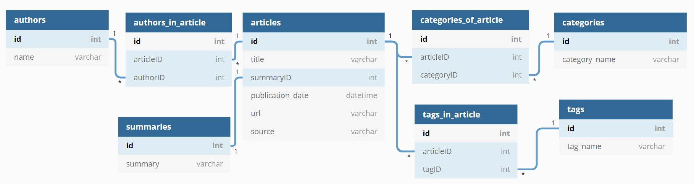

# Data Mining Project

This is a web scraping project for scraping metadata regarding articles from CoinDesk website.
CoinDesk is a news site specializing in bitcoin and digital currencies. Shakil Khan founded the site, which 
covers sections like Business, Technology, Regulation, and more.

## Purpose:
The purpose of this project is to collect data that, when analyzed further, may reveal trends regarding articles 
relating to cryptocurrency.

##Function:
The program will output the metadata about the relevant articles.
On each article, the following metadata is collected and stored:\
The title, author, date, tags, category and a short summary.

This program gives the user the ability to choose which category (latest, tech, business, regulation, people, 
features, opinion, markets) from coindesk.com they would like to scrape. As well as number of articles or all 
articles since a given date.

Furthermore, the user can enrich the scraped data with articles matching the ten most common tags scraped from 
other web domains. This is achieved through the integration of News API. 

All scraped data is stored in a database with structure as shown below:



## Technology:
There are three main technologies used in this project:

####Beautiful Soup   
Beautiful Soup is a Python package for parsing HTML and XML documents. It creates a parse tree for parsed pages that can be used to extract data from HTML, which is useful for web scraping. We scraped the metadata of the articles using it.

####Selenium  
Selenium WebDriver is a collection of open source APIs which are used to automate the testing of a web application. We used it to automate the CoinDesk website navigation and make scraping faster.

####PyMySQL 
PyMySQL is an interface for connecting to a MySQL database server from Python. It implements the Python Database API v2. 0 and contains a pure-Python MySQL client library. The goal of PyMySQL is to be a drop-in replacement for MySQLdb.

####NewsAPI
The main use of News API is to search through every article published by over 80,000 news sources and blogs in the last 3 years. 


## Run Locally

Prerequisites:
For Chrome users, WebDriver is available from this website:
https://chromedriver.chromium.org/downloads

Clone the project

```bash
  git clone https://github.com/AkivaCrouse/Datamining-Project.git
```

Install dependencies

```bash
  pip install -r requirements.txt
```

Initialize the database

```bash
  sql_script.py [-h] [-u USERNAME] -p PASSWORD [-host HOST] [-db DATABASE] [--print] [--delete] [--reset]
```
Positional arguments:  
>  category:  
Choose one of the following categories: latest, tech,
                        business, regulation, people, features, opinion,
                        markets.

Optional arguments:  
>  -num num_articles:  
You can choose one of the two options: -num or -date.
                        Choose number of articles, from 1 to 1000 in "-num
                        [your number]" format.

 > -date from_date:  
  You can choose one of the two options: -num or -date.
                        Enter Date in "-date YYYY-MM-DD" format. You will get
                        articles published after that date

  >-u USERNAME, --username USERNAME:  
                        username of mysql

  >-host HOST:  
  url of database server

  >-db DATABASE, --database DATABASE:  
                        Name of database to insert to

>required arguments:\
  -p PASSWORD, --password PASSWORD
                        password of mysql\


###Run the program

```bash
  Coindesk_Scraper.py (-num num_articles | -date from_date) [-u USERNAME]
                           [-$ {1,0}] -p PASSWORD [-host HOST] [-db DATABASE]
                           category
```

positional arguments:  
  >category:  
  Choose one of the following categories: latest, tech,
                        business, regulation, people, features, opinion,
                        markets.

optional arguments:  
  >-num num_articles:  
   You can choose one of the two options: -num or -date.
                        Choose number of articles, from 1 to 1000 in "-num
                        [your number]" format.

  >-date from_date:  
    You can choose one of the two options: -num or -date.
                        Enter Date in "-date YYYY-MM-DD" format. You will get
                        articles published after that date.

  >-u USERNAME, --username USERNAME:  
                        username of mysql

  >-$ {1,0}, --enrich {1,0}:  
                        Data enrichment with articles from other sources. 1 =
                        Enrich, 0 = Do not enrich

  >-host HOST:  
  url of database server
  -db DATABASE, --database DATABASE
                        Name of database to insert to

required arguments:  
  >-p PASSWORD, --password PASSWORD
                        password of mysql


  
## Acknowledgements

 - [Selenium with Python](https://selenium-python.readthedocs.io/)
 - [Beautiful Soup Tutorial](https://www.dataquest.io/blog/web-scraping-python-using-beautiful-soup/)
 - [ChromeDriver](https://chromedriver.chromium.org/getting-started)
 - [News API](https://newsapi.org/docs/client-libraries/python)
 

  
## Authors

- [@AkivaCrouse](https://github.com/AkivaCrouse)
- [@Ohad95](https://www.github.com/Ohad95)
- [@metalbored](https://github.com/metalbored)
  
